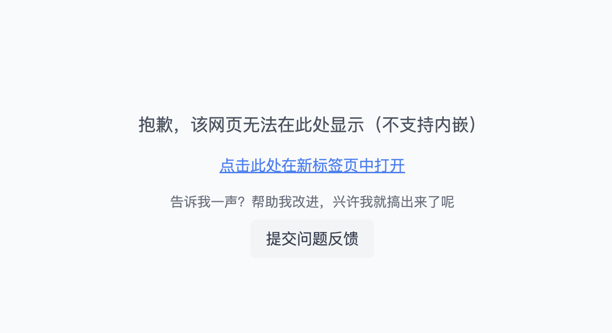

# Van Hub

<b>收集你的零零散散。</b>

作为一个折腾玩家，怎么能没有一款收集你所有网站的汇总平台呢？无需跳转 all in one! 也很适合作为团队内部工具平台。

> 在线体验 [https://van-hub-demo.mereith.com](https://van-hub-demo.mereith.com)

## 功能特性

- <b>🏆 内嵌工具，无需跳转</b>
- 🔍 工具搜索与标签筛选
- 📱 响应式设计
- 🎨 简洁美观的界面
- 🔐 管理员后台
- ⚡️ 快速部署
- 🎯 支持自定义网站标题和图标
- 📝 优雅的失败提示

### 工具详情


### 首页


### 管理后台


## 失败提示



## 部署

### Docker 部署

1. 直接运行

```bash
# JWT_SECRET 设置成一个随机的长一些的字符串
docker run -d \
--name van-hub \
-p 3000:3000 \
-v $(pwd)/data:/app/data \
-e JWT_SECRET=van-hub-default-secret-key \
mereith/van-hub:latest
```

3. 访问 http://localhost:3000

4. 默认管理员账号:

- 用户名: admin
- 密码: admin

### 手动部署

1. 克隆仓库:

```bash
git clone https://github.com/mereithhh/van-hub.git
```

2. 安装依赖:

```bash
npm install
```

3. 运行:

```bash
npm run dev
```

## FAQ

### 备份迁移

本项目的全部数据都存在一个 sqlite 数据库文件中，你只需要将这个文件备份，就可以迁移到其他机器上。

```bash
# 备份
docker cp van-hub:/app/data/data.db ./data/data.db

# 新启动的时候挂载上这个文件到 /app/data 目录就行了
# JWT_SECRET 设置成一个随机的长一些的字符串
docker run -d \
--name van-hub \
-p 3000:3000 \
-v $(pwd)/data:/app/data \
-e JWT_SECRET=van-hub-default-secret-key \
mereith/van-hub:latest
```

## 技术栈

- Next.js 14
- TypeScript
- Tailwind CSS
- SQLite
- Docker

## License

GPL-3.0
