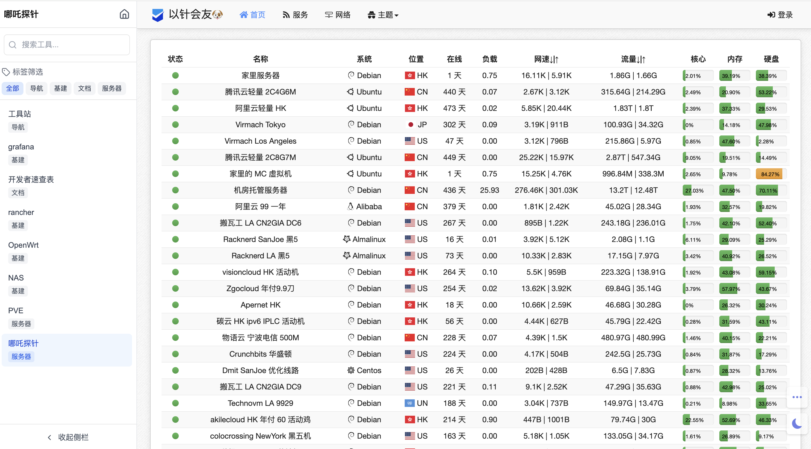
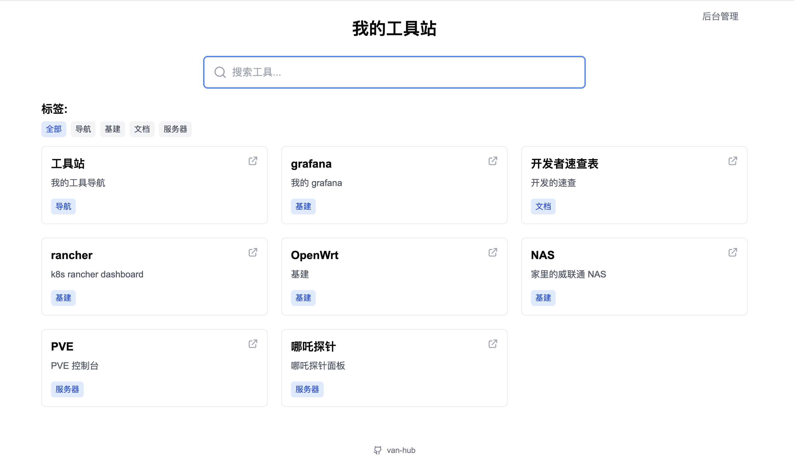
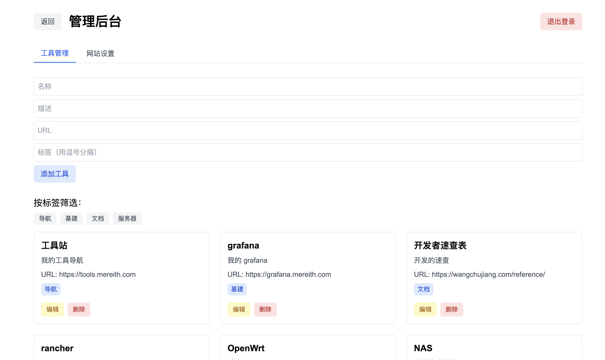
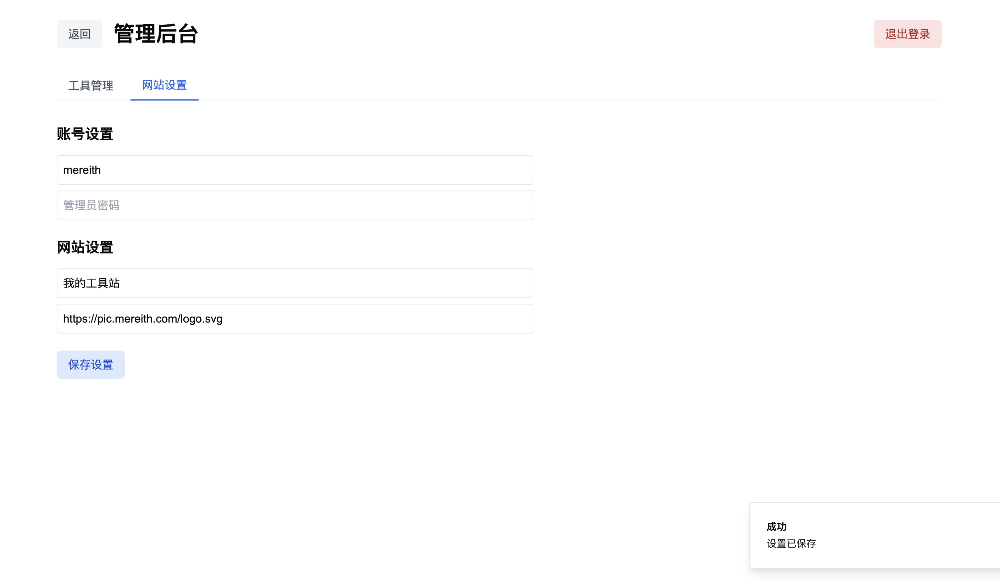

# Van Hub

<b>收集你的零零散散。</b>

作为一个折腾玩家，怎么能没有一款手机你所有网站的汇总平台呢？无需跳转 all in one! 也很适合作为团队内部工具平台。

## 功能特性

- <b>🏆 内嵌工具，无需跳转</b>
- 🔍 工具搜索与标签筛选
- 📱 响应式设计
- 🎨 简洁美观的界面
- 🔐 管理员后台
- ⚡️ 快速部署
- 🎯 支持自定义网站标题和图标

### 工具详情



### 首页



### 管理后台




## 部署

### Docker 部署

1. 创建 docker-compose.yml:

```yaml
version: '3'
services:
van-hub:
image: mereith/van-hub:latest
container_name: van-hub
restart: always
ports:
"3000:3000"
volumes:
./data:/app/data
environment:
JWT_SECRET=your_jwt_secret # 修改为你的 JWT 密钥
```

3. 访问 http://localhost:3000

4. 默认管理员账号:

- 用户名: admin
- 密码: admin

### 手动部署

1. 克隆仓库:

```bash
git clone https://github.com/mereithhh/van-hub.git
```

2. 安装依赖:

```bash
npm install
```

3. 运行:

```bash
npm run dev
```

## 技术栈

- Next.js 14
- TypeScript
- Tailwind CSS
- SQLite
- Docker

## License

GPL-3.0
